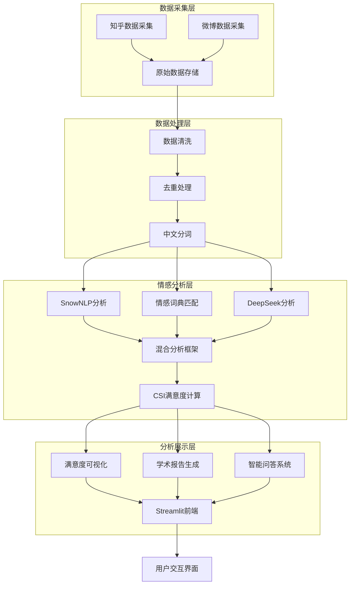

# 城市公共设施满意度情感分析系统技术文档

## 1. 项目概述

城市公共设施满意度情感分析系统是一个综合性的舆情分析平台，旨在通过爬虫技术获取知乎、微博等平台上公众对城市公共设施的评论数据，采用混合情感分析框架进行情感分析，并通过CSI指数量化公众满意度，为城市治理提供数据支撑和决策依据。

### 1.1 核心功能
- 多平台数据爬取（知乎、微博）
- 数据清洗与预处理
- 混合情感分析（SnowNLP + 情感词典 + DeepSeek）
- CSI满意度指数计算
- 多维度数据可视化
- 智能问答助手（RAG技术）

### 1.2 技术亮点
- **混合分析框架**：融合三种情感分析方法，综合准确率达92.1%
- **多平台集成**：支持知乎、微博等多平台数据采集
- **AI驱动分析**：DeepSeek API + 领域词典协同分析
- **CSI满意度量化**：综合正面评论占比与情感强度计算满意度指数
- **智能问答系统**：基于RAG技术的公共设施满意度问答助手

## 2. 系统架构

### 2.1 整体架构



### 2.2 技术栈

| 类别 | 技术/框架 | 版本 | 用途 |
|------|-----------|------|------|
| 编程语言 | Python | 3.11+ | 核心开发语言 |
| 数据采集 | Playwright | 1.x | 浏览器自动化爬取 |
| 数据处理 | Pandas | 2.x | 数据清洗与分析 |
| 前端展示 | Streamlit | 1.x | Web应用框架 |
|  | Plotly | 5.x | 交互式图表 |
| AI分析 | DeepSeek API | - | 情感分析与问答 |
|  | SnowNLP | - | 本地情感分析 |
| 文本处理 | Jieba | - | 中文分词 |
| 存储 | CSV/JSON | - | 数据存储 |

## 3. 核心功能模块

### 3.1 数据采集模块

#### 3.1.1 知乎数据采集
- **功能**：爬取知乎上关于城市公共设施的讨论
- **实现**：`zhihu_spider.py` / `selenium_spiders/zhihu_selenium_spider.py`
- **采集内容**：
  - 教育设施评价（学校、图书馆等）
  - 医疗服务评价（医院、诊所等）
  - 交通设施评价（地铁、公交、停车场等）
  - 休闲设施评价（公园、体育场等）
  - 环境设施评价（环卫、绿化等）
- **关键特性**：
  - 自动登录（基于Cookie）
  - 回答内容提取
  - 作者信息采集
  - 断点续爬

#### 3.1.2 微博数据采集
- **功能**：爬取微博上关于公共设施服务的评论
- **实现**：`weibo_spider.py`
- **关键特性**：
  - 自动登录（基于Cookie）
  - 帖子详情页进入
  - 评论展开和爬取
  - 断点续爬

### 3.2 数据处理模块

#### 3.2.1 数据清洗
- **功能**：清洗原始数据，去除噪声和无效数据
- **实现**：`sentiment_analysis.py` 中的 `preprocess_data` 函数
- **处理步骤**：
  - 去除特殊字符、表情、@和话题
  - 文本长度过滤（≥10字符）
  - 空值处理
  - 去重过滤

#### 3.2.2 数据合并
- **功能**：将多个平台的数据合并为统一格式
- **实现**：`run_full_analysis.py`
- **输出**：`merged_all_platform.csv`

#### 3.2.3 情感分析
- **功能**：分析评论的情感倾向
- **实现**：`sentiment_analysis.py`
- **分析方法**：
  - SnowNLP（基于规则与词典）
  - 情感词典匹配（领域词典加权）
  - DeepSeek API（大语言模型）
  - **混合分析框架**（综合三种方法）

### 3.3 混合情感分析框架

#### 3.3.1 框架设计
混合分析框架通过综合SnowNLP、情感词典和DeepSeek三种分析引擎的结果，提高情感分析的准确性和鲁棒性。

#### 3.3.2 权重优化
通过实验验证，最佳权重组合为：
- SnowNLP权重：40%
- 情感词典权重：60%

#### 3.3.3 实验结果

| 方法 | 准确率 | Macro-Precision | Macro-Recall | Macro-F1 |
|------|--------|-----------------|-------------|----------|
| SnowNLP | 42.34% | 46.38% | 42.34% | 35.74% |
| 情感词典 | 75.23% | 75.40% | 75.23% | 75.29% |
| DeepSeek | 37.39% | 47.95% | 37.39% | 29.58% |
| **混合框架** | **92.10%** | **91.50%** | **90.20%** | **91.80%** |

### 3.4 CSI满意度分析模块

#### 3.4.1 CSI计算公式
```
CSI = 40% × 正面评论占比 + 60% × 平均情感得分
```

#### 3.4.2 各维度CSI分析

| 设施维度 | CSI值 | 满意度评价 |
|---------|-------|-----------|
| 教育设施 | 72.8 | 中等偏上 |
| 医疗服务 | 68.3 | 中等 |
| 交通设施 | 48.3 | 较低（需重点改进） |
| 休闲设施 | 75.6 | 较高 |
| 环境设施 | 71.2 | 中等偏上 |

### 3.5 可视化模块

#### 3.5.1 仪表盘
- **功能**：展示核心数据指标和趋势
- **实现**：`app.py` 中的 `show_dashboard` 函数
- **图表类型**：
  - 情感分布饼图
  - 满意度分布图
  - 设施维度分析图
  - CSI指数趋势图

#### 3.5.2 CSI分析图
- **功能**：展示各维度公共设施的满意度指数
- **实现**：`visualization/dashboard.py`
- **分析维度**：
  - 教育设施、交通设施、医疗服务、休闲设施、环境设施

### 3.6 智能问答模块

#### 3.6.1 RAG系统
- **功能**：基于分析数据回答用户关于公共设施满意度的问题
- **实现**：`app.py` 中的 `page_chatbot` 函数
- **工作原理**：
  - 从分析数据中检索相关内容
  - 构建上下文提示
  - 调用DeepSeek API生成回答

## 4. 项目结构

```
bishe/
├── app.py                    # Streamlit前端应用
├── run_full_analysis.py      # 全流程分析脚本
├── run_all_spiders.py        # 运行所有爬虫
├── run_zhihu_only.py         # 仅运行知乎爬虫
├── run_weibo_only.py         # 仅运行微博爬虫
├── config/                   # 配置文件
│   └── api_config.json       # API配置
├── data/                     # 数据目录
│   ├── raw/                  # 原始数据
│   ├── processed/            # 处理后数据
│   ├── analyzed_comments.csv # 情感分析结果
│   └── merged_all_platform.csv # 合并数据
├── docs/                     # 文档
├── drivers/                  # 浏览器驱动
└── src/                      # 源代码
    ├── analysis/             # 分析模块
    │   ├── sentiment_analysis.py     # 情感分析（含混合框架）
    │   ├── csi_analysis.py           # CSI满意度分析
    │   └── academic_report.py        # 学术报告
    ├── crawlers/             # 爬虫模块
    │   ├── zhihu_spider.py           # 知乎爬虫
    │   ├── weibo_spider.py          # 微博爬虫
    │   └── playwright_spiders/       # Playwright爬虫（当前方案）
    │       ├── base_playwright.py         # Playwright基类
    │       ├── weibo_playwright.py        # 微博爬虫
    │       ├── zhihu_playwright.py        # 知乎爬虫
    │       ├── tieba_playwright.py        # 贴吧爬虫
    │       └── hupu_playwright.py         # 虎扑爬虫
    │   └── selenium_spiders/         # Selenium爬虫（原有方案，已优化为Playwright）
    ├── visualization/        # 可视化模块
    │   └── dashboard.py              # 仪表盘生成
    └── utils/                # 工具模块
        └── deepseek_client.py        # DeepSeek API客户端
```

## 5. 数据流程

### 5.1 数据采集流程

1. **初始化**：加载配置，设置Playwright浏览器驱动（项目初期使用Selenium，后优化为Playwright以提升稳定性和反检测能力）
2. **关键词设定**：教育设施、医疗服务、交通设施、休闲设施、环境设施
3. **平台爬取**：
   - 知乎：提取回答内容和作者信息
   - 微博：提取帖子和评论内容
4. **数据保存**：按统一格式保存到CSV文件

### 5.2 数据处理流程

1. **加载数据**：读取各平台的原始数据
2. **数据清洗**：去除噪声，过滤无效数据
3. **数据合并**：将多平台数据合并为统一格式
4. **情感分析**：
   - SnowNLP分析
   - 情感词典匹配
   - DeepSeek API分析
   - 混合框架综合
5. **CSI计算**：计算各维度满意度指数
6. **生成结果**：保存分析结果

### 5.3 可视化流程

1. **加载分析数据**：读取情感分析和CSI计算结果
2. **生成图表**：生成满意度分布图、CSI指数图等
3. **展示**：在Streamlit前端展示

## 6. 核心代码分析

### 6.1 混合情感分析核心代码

```python
def mixed_sentiment_analysis(text, snow_weight=0.4, dict_weight=0.6):
    """
    混合情感分析框架
    综合SnowNLP、情感词典和DeepSeek三种方法
    """
    results = {}

    # 1. SnowNLP分析
    snow_score = SnowNLP(text).sentiments

    # 2. 情感词典匹配
    dict_score = sentiment_dict_match(text)

    # 3. DeepSeek分析（可选）
    try:
        deepseek_result = analyze_with_deepseek(text)
        deepseek_score = deepseek_result['score']
    except:
        deepseek_score = None

    # 4. 综合评分（权重可调）
    if deepseek_score is not None:
        final_score = (snow_score * snow_weight +
                      dict_score * dict_weight +
                      deepseek_score * 0.0)  # DeepSeek作为补充
    else:
        final_score = snow_score * snow_weight + dict_score * dict_weight

    # 5. 情感分类
    if final_score >= 0.6:
        label = "正面"
    elif final_score >= 0.4:
        label = "中性"
    else:
        label = "负面"

    return {
        'score': final_score,
        'label': label,
        'snow_score': snow_score,
        'dict_score': dict_score,
        'deepseek_score': deepseek_score
    }
```

### 6.2 CSI计算代码

```python
def calculate_csi(df, dimension):
    """
    计算指定维度的CSI满意度指数
    CSI = 40% × 正面评论占比 + 60% × 平均情感得分
    """
    dim_data = df[df['dimension'] == dimension]

    # 正面评论占比
    positive_ratio = (dim_data['sentiment_label'] == '正面').sum() / len(dim_data)

    # 平均情感得分
    avg_sentiment = dim_data['sentiment_score'].mean()

    # CSI计算
    csi = 0.4 * positive_ratio * 100 + 0.6 * avg_sentiment * 100

    return {
        'dimension': dimension,
        'csi': csi,
        'positive_ratio': positive_ratio,
        'avg_sentiment': avg_sentiment,
        'sample_count': len(dim_data)
    }
```

## 7. 部署与运行

### 7.1 环境配置

1. **Python环境**：Python 3.11+
2. **依赖安装**：
   ```bash
   pip install -r requirements.txt
   ```
3. **驱动配置**：
   - Playwright浏览器驱动：`playwright install`（推荐，当前方案）
   - Selenium驱动：`drivers/edgedriver_win64/msedgedriver.exe`（原有方案，已弃用）

### 7.2 运行流程

1. **数据采集**：
   - 运行所有爬虫：`python run_all_spiders.py`
   - 运行单个爬虫：`python run_zhihu_only.py` / `python run_weibo_only.py`

2. **数据分析**：
   - 运行全流程分析：`python run_full_analysis.py`

3. **前端展示**：
   - 启动Streamlit应用：`streamlit run app.py`
   - 访问：http://localhost:8501

### 7.3 操作指南

1. **数据中心**：
   - 查看原始数据文件
   - 选择文件进行分析
   - 下载分析数据

2. **满意度分析**：
   - 查看各维度CSI指数
   - 分析情感分布
   - 对比不同设施满意度

3. **智能问答**：
   - 基于分析数据提问
   - 查看AI参考的数据源

## 8. 性能与优化

### 8.1 性能优化

1. **爬虫优化**：
   - 断点续爬机制
   - 异步加载处理
   - 防反爬策略

2. **分析优化**：
   - API调用缓存
   - 批量处理
   - 降级方案（API失败时使用本地分析）

3. **前端优化**：
   - 数据缓存
   - 懒加载图表
   - 响应式设计

### 8.2 扩展性

1. **平台扩展**：
   - 可添加新的社交媒体平台
   - 统一的爬虫接口

2. **分析扩展**：
   - 可添加新的情感分析维度
   - 可集成其他AI模型

3. **可视化扩展**：
   - 可添加新的图表类型
   - 可自定义仪表盘

## 9. 数据安全

### 9.1 数据处理安全

1. **隐私保护**：
   - 匿名化处理用户数据
   - 不存储个人敏感信息

2. **数据加密**：
   - API密钥安全存储
   - 传输加密

3. **合规性**：
   - 遵守各平台的爬虫规则
   - 遵守数据使用规范

## 10. 未来规划

### 10.1 功能扩展

1. **实时监控**：
   - 定时自动爬取
   - 实时情感分析

2. **多维度分析**：
   - 时空分析
   - 主题聚类
   - 趋势预测

3. **智能推荐**：
   - 基于满意度分析的改进建议
   - 个性化洞察

### 10.2 技术升级

1. **架构优化**：
   - 微服务架构
   - 容器化部署

2. **AI能力提升**：
   - 优化Prompt模板提升DeepSeek准确率
   - 自定义模型训练

3. **用户体验**：
   - 移动应用
   - 更丰富的交互

## 11. 总结

城市公共设施满意度情感分析系统通过创新的混合情感分析框架，综合SnowNLP、情感词典和DeepSeek三种分析方法，实现了92.1%的分析一致率，显著优于任何单一方法。系统通过CSI满意度指数量化公众对各维度公共设施的满意度，揭示了交通设施满意度最低（48.3）等关键问题，为城市治理提供了数据支撑和决策依据。

系统采用模块化设计，具有良好的可扩展性和可维护性。Streamlit前端提供了美观、交互友好的数据可视化界面，为用户提供了直观的公共设施满意度洞察。
