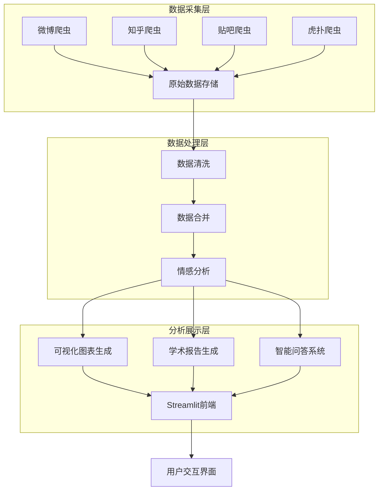

# 上海迪士尼数据分析系统技术文档

## 1. 项目概述

上海迪士尼数据分析系统是一个综合性的舆情分析平台，旨在通过爬虫技术获取多平台（微博、知乎、贴吧、虎扑）关于上海迪士尼的用户评论数据，进行情感分析、数据可视化和智能决策支持。

### 1.1 核心功能
- 多平台数据爬取（微博、知乎、贴吧、虎扑）
- 数据清洗与预处理
- AI情感分析（基于DeepSeek API）
- 多维度数据可视化
- 智能决策助手（RAG）
- 学术报告自动生成

### 1.2 技术亮点
- **全流程自动化**：从数据采集到分析展示的完整流程
- **多平台集成**：支持多个社交媒体平台的数据采集
- **AI驱动分析**：使用DeepSeek API进行情感分析
- **实时可视化**：丰富的图表和交互式仪表盘
- **智能问答系统**：基于RAG技术的智能决策助手
- **统一数据格式**：严格的数据格式规范确保数据一致性

## 2. 系统架构

### 2.1 整体架构



### 2.2 技术栈

| 类别 | 技术/框架 | 版本 | 用途 |
|------|-----------|------|------|
| 编程语言 | Python | 3.13 | 核心开发语言 |
| 爬虫 | Selenium | 4.x | 浏览器自动化爬取 |
| 数据处理 | Pandas | 2.x | 数据清洗与分析 |
| 可视化 | Streamlit | 1.x | 前端展示框架 |
|  | Plotly | 5.x | 交互式图表 |
|  | Pyecharts | 2.x | 额外图表支持 |
| AI分析 | DeepSeek API | - | 情感分析 |
|  | SnowNLP | - | 本地情感分析（降级方案） |
| 文本处理 | Jieba | - | 中文分词 |
| 存储 | CSV | - | 数据存储 |
|  | JSON | - | 配置和缓存 |

## 3. 核心功能模块

### 3.1 数据采集模块

#### 3.1.1 微博爬虫
- **功能**：爬取微博上关于上海迪士尼的帖子和评论
- **实现**：`weibo_spider.py`
- **关键特性**：
  - 自动登录（基于Cookie）
  - 帖子详情页进入
  - 评论展开和爬取
  - 断点续爬

#### 3.1.2 知乎爬虫
- **功能**：爬取知乎上关于上海迪士尼的回答
- **实现**：`src/crawlers/selenium_spiders/zhihu_selenium_spider.py`
- **关键特性**：
  - 自动登录
  - 回答内容提取
  - 作者信息采集

#### 3.1.3 贴吧爬虫
- **功能**：爬取百度贴吧上关于上海迪士尼的帖子和回复
- **实现**：`src/crawlers/selenium_spiders/tieba_selenium_spider.py`
- **关键特性**：
  - 多页面爬取
  - 回复内容提取
  - 防反爬机制

#### 3.1.4 虎扑爬虫
- **功能**：爬取虎扑论坛上关于上海迪士尼的帖子
- **实现**：`src/crawlers/selenium_spiders/hupu_selenium_spider.py`
- **关键特性**：
  - 帖子内容提取
  - 评论数统计

### 3.2 数据处理模块

#### 3.2.1 数据清洗
- **功能**：清洗原始数据，去除噪声和无效数据
- **实现**：`src/analysis/sentiment_analysis.py` 中的 `preprocess_data` 函数
- **处理步骤**：
  - 去除特殊字符、表情、@和话题
  - 文本长度过滤（≥10字符）
  - 空值处理

#### 3.2.2 数据合并
- **功能**：将多个平台的数据合并为统一格式
- **实现**：`run_full_analysis.py`
- **输出**：`data/merged_all_platform.csv`

#### 3.2.3 情感分析
- **功能**：分析评论的情感倾向
- **实现**：`src/analysis/sentiment_analysis.py`
- **分析方法**：
  - DeepSeek API（优先）
  - SnowNLP（API失败时降级）
- **输出**：`data/analyzed_comments.csv`

### 3.3 可视化模块

#### 3.3.1 仪表盘
- **功能**：展示核心数据指标和趋势
- **实现**：`app.py` 中的 `show_dashboard` 函数
- **图表类型**：
  - 情感分布饼图
  - 满意度分布图
  - 紧急度分布图
  - 设施类型分析图
  - 方面维度分析图

#### 3.3.2 图表生成
- **功能**：生成各种分析图表
- **实现**：`src/visualization/dashboard.py`
- **输出**：`data/viz/` 目录下的图表文件

### 3.4 智能问答模块

#### 3.4.1 RAG系统
- **功能**：基于分析数据回答用户问题
- **实现**：`app.py` 中的 `page_chatbot` 函数
- **工作原理**：
  - 从分析数据中检索相关内容
  - 构建上下文
  - 调用DeepSeek API生成回答

### 3.5 报告生成模块

#### 3.5.1 学术报告
- **功能**：自动生成分析报告
- **实现**：`src/analysis/academic_report.py`
- **输出**：`data/academic_report_*.md`

## 4. 项目结构

```
bishe/
├── app.py                    # Streamlit前端应用
├── run_full_analysis.py      # 全流程分析脚本
├── run_all_spiders.py        # 运行所有爬虫
├── run_weibo_only.py         # 仅运行微博爬虫
├── run_zhihu_only.py         # 仅运行知乎爬虫
├── run_tieba_only.py         # 仅运行贴吧爬虫
├── run_hupu_only.py          # 仅运行虎扑爬虫
├── config/                   # 配置文件
│   └── api_config.json       # API配置
├── data/                     # 数据目录
│   ├── raw/                  # 原始数据
│   ├── viz/                  # 可视化图表
│   ├── cache/                # 缓存
│   ├── timeseries/           # 时间序列数据
│   ├── analyzed_comments.csv # 分析结果
│   └── merged_all_platform.csv # 合并数据
├── docs/                     # 文档
├── drivers/                  # 浏览器驱动
│   └── edgedriver_win64/     # Edge驱动
└── src/                      # 源代码
    ├── analysis/             # 分析模块
    │   ├── sentiment_analysis.py     # 情感分析
    │   ├── academic_report.py         # 学术报告
    │   └── advanced_analysis.py      # 高级分析
    ├── crawlers/             # 爬虫模块
    │   ├── weibo_spider.py           # 微博爬虫
    │   └── selenium_spiders/         # Selenium爬虫
    │       ├── common.py             # 通用爬虫基类
    │       ├── zhihu_selenium_spider.py # 知乎爬虫
    │       ├── tieba_selenium_spider.py # 贴吧爬虫
    │       └── hupu_selenium_spider.py  # 虎扑爬虫
    ├── visualization/        # 可视化模块
    │   └── dashboard.py              # 仪表盘生成
    ├── utils/                # 工具模块
    │   └── deepseek_client.py        # DeepSeek API客户端
    └── modules/              # 通用模块
        ├── data_merger.py            # 数据合并
        └── platform_crawler.py       # 平台爬虫基类
```

## 5. 数据流程

### 5.1 数据采集流程

1. **初始化**：加载配置，设置浏览器驱动
2. **登录**：使用Cookie自动登录各平台
3. **搜索**：搜索关键词"上海迪士尼"
4. **爬取**：
   - 微博：进入详情页，展开评论，提取内容
   - 知乎：提取回答内容和作者信息
   - 贴吧：提取帖子和回复
   - 虎扑：提取帖子内容
5. **保存**：按统一格式保存到CSV文件

### 5.2 数据处理流程

1. **加载数据**：读取各平台的原始数据
2. **清洗数据**：去除噪声，过滤无效数据
3. **合并数据**：将多平台数据合并为统一格式
4. **情感分析**：使用DeepSeek API分析情感
5. **生成结果**：保存分析结果

### 5.3 可视化流程

1. **加载分析数据**：读取分析结果
2. **生成图表**：生成各种可视化图表
3. **展示**：在Streamlit前端展示

## 6. 关键代码分析

### 6.1 爬虫核心代码

#### 6.1.1 微博爬虫 - 评论爬取

```python
def crawl_comments(self, post_idx):
    comments = []
    # 1. 加载更多评论（循环点击）
    while True:
        try:
            load_more_btn = self.wait.until(EC.element_to_be_clickable((By.CSS_SELECTOR, '.more-comment-btn')))
            load_more_btn.click()
            time.sleep(1)
            current_count = len(self.driver.find_elements(By.CSS_SELECTOR, '.comment-item'))
            print(f"[微博-第{post_idx+1}条帖子] 评论加载中：{current_count}条")
        except:
            break
    # 2. 提取评论
    comment_elems = self.driver.find_elements(By.CSS_SELECTOR, '.comment-item .WB_text')
    for elem in comment_elems:
        comments.append(elem.text.strip())
    print(f"\033[32m[成功]\033[0m 微博第{post_idx+1}条帖子爬取到{len(comments)}条评论")
    return comments
```

#### 6.1.2 数据格式规范处理

```python
def save_to_csv规范(data, file_path, fields):
    """按规范保存数据到CSV"""
    with open(file_path, 'a', encoding='utf-8', newline='') as f:
        writer = csv.DictWriter(f, fieldnames=fields)
        # 格式化每条数据
        for row in data:
            # 时间字段格式化
            if "publish_time" in row:
                row["publish_time"] = format_time_str(row["publish_time"])
            if "crawl_time" not in row:
                row["crawl_time"] = datetime.now().strftime("%Y-%m-%d %H:%M:%S")
            # 数值字段格式化
            for num_field in ["like_count", "comment_count", "forward_count"]:
                if num_field in row:
                    row[num_field] = format_numeric_value(row[num_field])
            # 空值替换为NULL
            for k, v in row.items():
                if v is None or v == "":
                    row[k] = "NULL"
            writer.writerow(row)
    # 可视化打印
    print(f"\033[34m[格式规范]\033[0m 已保存{len(data)}条数据到{file_path}，格式符合规范")
```

### 6.2 分析核心代码

#### 6.2.1 情感分析

```python
def analyze_dataframe(df, preferred="deepseek", progress_callback=None):
    """分析数据框中的情感"""
    results = []
    total = len(df)
    
    for i, row in df.iterrows():
        if progress_callback:
            progress_callback((i + 1) / total)
        
        text = row.get('content', row.get('content_clean', ''))
        if not text or len(text) < 5:
            results.append({
                'sentiment_score': 0.5,
                'sentiment_label': '中性',
                'sentiment_source': 'default'
            })
            continue
        
        # 优先使用DeepSeek API
        if preferred == "deepseek":
            try:
                sentiment = analyze_with_deepseek(text)
                results.append(sentiment)
                continue
            except Exception as e:
                print(f"[分析] DeepSeek API失败，降级为本地分析: {e}")
        
        # 本地分析
        sentiment = analyze_with_snownlp(text)
        results.append(sentiment)
    
    # 添加结果到数据框
    result_df = df.copy()
    result_df['sentiment_score'] = [r['sentiment_score'] for r in results]
    result_df['sentiment_label'] = [r['sentiment_label'] for r in results]
    result_df['sentiment_source'] = [r['sentiment_source'] for r in results]
    result_df['analyze_time'] = datetime.now().strftime("%Y-%m-%d %H:%M:%S")
    
    return result_df
```

### 6.3 前端核心代码

#### 6.3.1 仪表盘展示

```python
def show_dashboard(df):
    """驾驶舱：核心数据展示 + 整改推演"""
    col_title, col_time = st.columns([3, 1])
    with col_title:
        st.markdown("""
        <div style="display: flex; align-items: center; gap: 16px;">
            <div style="font-size: 48px;">🏙️</div>
            <div>
                <h1 style="margin: 0; font-size: 32px; font-weight: 800;">城市舆情态势感知中心</h1>
                <p style="margin: 4px 0 0 0; color: #8B949E;">实时监控城市公共设施服务质量与市民满意度</p>
            </div>
        </div>
        """, unsafe_allow_html=True)
    # ... 更多代码 ...
```

## 7. 部署与运行

### 7.1 环境配置

1. **Python环境**：Python 3.13
2. **依赖安装**：
   ```bash
   pip install -r REQUIREMENTS.md
   ```
3. **驱动配置**：
   - Edge驱动：`drivers/edgedriver_win64/msedgedriver.exe`

### 7.2 运行流程

1. **数据采集**：
   - 运行所有爬虫：`python run_all_spiders.py`
   - 运行单个爬虫：`python run_weibo_only.py` 等

2. **数据分析**：
   - 运行全流程分析：`python run_full_analysis.py`

3. **前端展示**：
   - 启动Streamlit应用：`streamlit run app.py`
   - 访问：http://localhost:8502

### 7.3 操作指南

1. **数据中心**：
   - 查看原始数据文件
   - 选择文件进行分析
   - 下载原始数据

2. **驾驶舱**：
   - 查看核心指标
   - 分析情感分布
   - 查看设施类型分析
   - 查看方面维度分析
   - 深度分析
   - 详细数据列表

3. **智能问答**：
   - 基于分析数据提问
   - 查看AI参考的数据源

4. **报告下载**：
   - 下载Markdown格式的学术报告
   - 下载分析数据源

## 8. 性能与优化

### 8.1 性能优化

1. **爬虫优化**：
   - 断点续爬机制
   - 异步加载处理
   - 防反爬策略

2. **分析优化**：
   - API调用缓存
   - 批量处理
   - 降级方案（API失败时使用本地分析）

3. **前端优化**：
   - 数据缓存
   - 懒加载图表
   - 响应式设计

### 8.2 扩展性

1. **平台扩展**：
   - 可轻松添加新的社交媒体平台
   - 统一的爬虫接口

2. **分析扩展**：
   - 可添加新的分析维度
   - 可集成其他AI模型

3. **可视化扩展**：
   - 可添加新的图表类型
   - 可自定义仪表盘

## 9. 数据安全

### 9.1 数据处理安全

1. **隐私保护**：
   - 匿名化处理用户数据
   - 不存储个人敏感信息

2. **数据加密**：
   - API密钥安全存储
   - 传输加密

3. **合规性**：
   - 遵守各平台的爬虫规则
   - 遵守数据使用规范

### 9.2 系统安全

1. **访问控制**：
   - 本地部署，无外部访问
   - 敏感配置文件保护

2. **错误处理**：
   - 完善的异常处理
   - 日志记录

## 10. 未来规划

### 10.1 功能扩展

1. **实时监控**：
   - 定时自动爬取
   - 实时情感分析

2. **多维度分析**：
   - 时空分析
   - 主题聚类
   - 趋势预测

3. **智能推荐**：
   - 基于情感分析的推荐
   - 个性化洞察

### 10.2 技术升级

1. **架构优化**：
   - 微服务架构
   - 容器化部署

2. **AI能力提升**：
   - 集成更多AI模型
   - 自定义模型训练

3. **用户体验**：
   - 移动应用
   - 更丰富的交互

### 10.3 应用场景扩展

1. **行业扩展**：
   - 适用于其他主题公园
   - 适用于其他旅游景点

2. **企业应用**：
   - 品牌声誉管理
   - 产品反馈分析

3. **政府应用**：
   - 公共服务满意度分析
   - 舆情监测

## 11. 总结

上海迪士尼数据分析系统是一个功能完整、技术先进的舆情分析平台。它通过多平台数据采集、AI情感分析、丰富的可视化和智能问答系统，为上海迪士尼的运营和管理提供了数据支持和决策依据。

系统采用模块化设计，具有良好的可扩展性和可维护性。通过统一的数据格式规范，确保了数据的一致性和可靠性。前端展示界面美观、交互友好，为用户提供了直观的数据洞察。

未来，系统可以通过功能扩展、技术升级和应用场景扩展，进一步提升其价值和影响力，成为舆情分析领域的标杆产品。